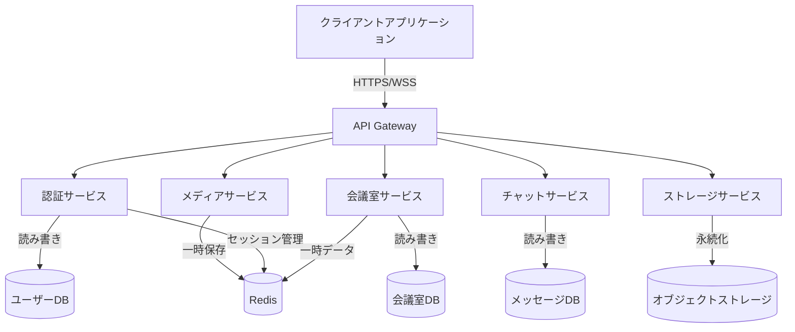
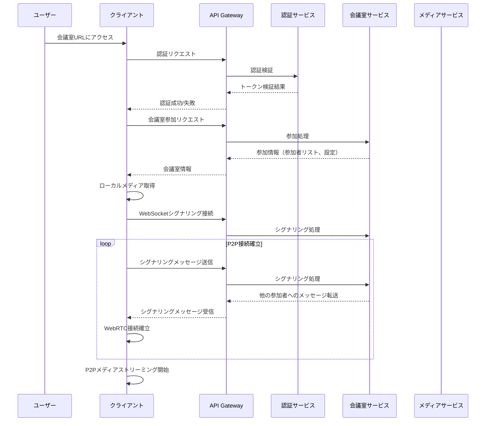

# システムアーキテクチャ

WebMTG Systemは、スケーラビリティ、保守性、セキュリティを考慮したマイクロサービスアーキテクチャを採用しています。このページでは、システム全体のアーキテクチャと各コンポーネントの役割について説明します。

## 全体アーキテクチャ

WebMTG Systemのアーキテクチャは以下の主要コンポーネントで構成されています。

## コンポーネント詳細

### クライアントアプリケーション

- **技術**: React, TypeScript, WebRTC
- **役割**: ユーザーインターフェースの提供、ローカルメディアの管理、ピアツーピア通信の確立
- **機能**:
    - ユーザー認証
    - 会議室の作成・参加
    - ビデオ/音声の送受信
    - 画面共有
    - チャットメッセージの送受信
    - 会議室設定の管理

### API Gateway

- **技術**: Nginx, Traefik など
- **役割**: リクエストのルーティング、SSL終端、負荷分散
- **機能**:
    - HTTPSおよびWSSトラフィックの処理
    - マイクロサービスへのリクエスト振り分け
    - レート制限
    - 基本的なリクエストフィルタリング
    - ヘルスチェック

### 認証サービス

- **技術**: FastAPI, JWT
- **役割**: ユーザー認証と認可
- **機能**:
    - ユーザー登録/ログイン
    - JWTトークン発行と検証
    - セッション管理
    - 権限チェック

### 会議室サービス

- **技術**: FastAPI, WebSockets
- **役割**: 会議室の管理とシグナリング
- **機能**:
    - 会議室の作成/削除/管理
    - 参加者の管理
    - WebRTCシグナリング
    - 会議設定の管理

### メディアサービス

- **技術**: WebRTC SFU/MCU, メディアサーバー
- **役割**: メディアストリームの管理（必要に応じて）
- **機能**:
    - メディアストリームのルーティング
    - 録画
    - トランスコーディング

### チャットサービス

- **技術**: FastAPI, WebSockets
- **役割**: リアルタイムメッセージング
- **機能**:
    - テキストメッセージの送受信
    - ファイル共有
    - メッセージ履歴管理

### ストレージサービス

- **技術**: FastAPI, MinIO
- **役割**: ファイルとメディアの保存
- **機能**:
    - 会議録画の保存
    - 共有ファイルの管理
    - 一時ファイルのクリーンアップ

## データフロー

典型的なユースケースにおけるデータフローを以下に示します：

### 会議室参加シナリオ

## スケーラビリティ考慮事項

WebMTG Systemは、以下の方法でスケーラビリティを確保しています：

1. **マイクロサービスアーキテクチャ**: 各サービスを独立してスケールすることが可能
2. **ステートレスなバックエンド**: セッション情報はRedisに保存し、水平スケーリングを容易に
3. **P2P通信の優先**: 可能な限りP2P通信を使用し、サーバーリソースを節約
4. **リージョン最適化**: 将来的に地理的に分散したデプロイメントをサポート

## セキュリティ考慮事項

1. **E2Eの暗号化**: WebRTCによるメディアストリームの暗号化
2. **JWT認証**: セキュアなトークンベースの認証
3. **HTTPS/WSS**: すべての通信の暗号化
4. **入力検証**: すべてのユーザー入力の厳格な検証
5. **権限管理**: 細分化されたアクセス制御

## 今後の拡張計画

1. **フェデレーション**: 複数のサーバー間での相互運用性
2. **高度なメディア処理**: ノイズ抑制、背景置換などのAI機能
3. **スケーリング自動化**: 負荷に応じた自動スケーリング
4. **障害検出と自動復旧**: システムの堅牢性向上
